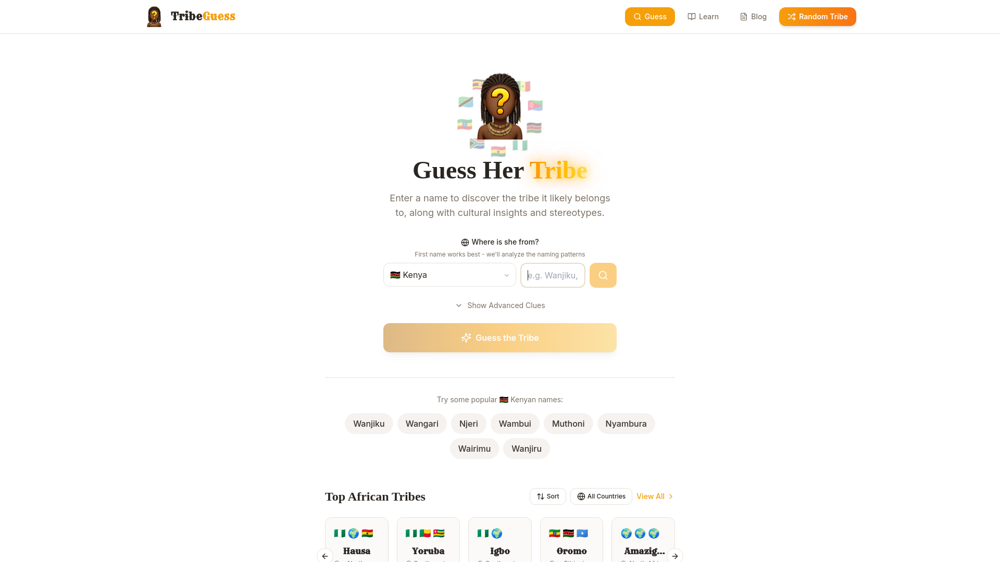
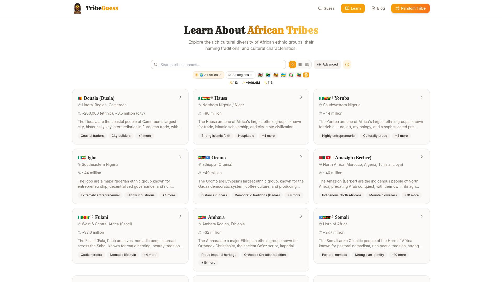
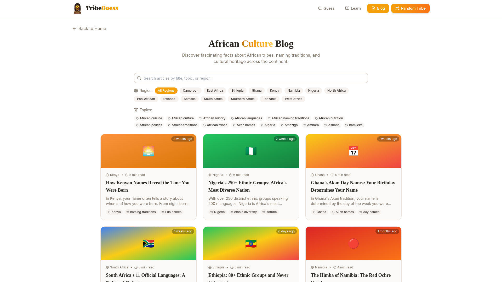
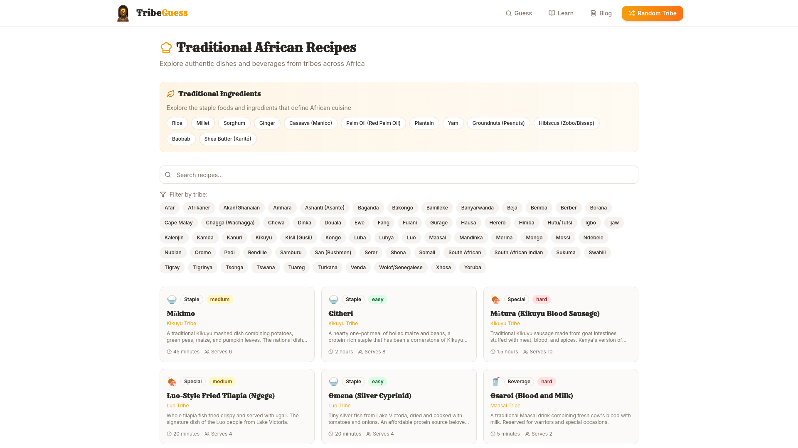
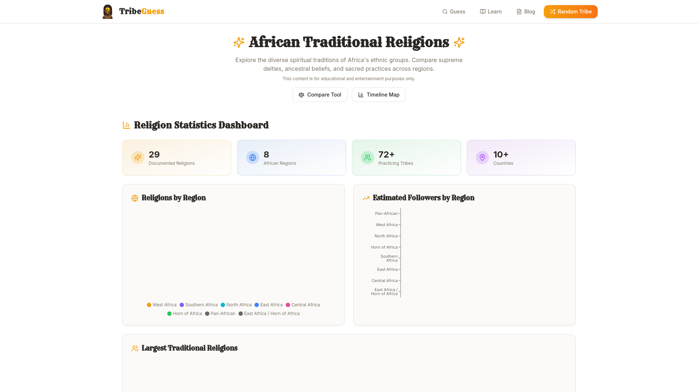
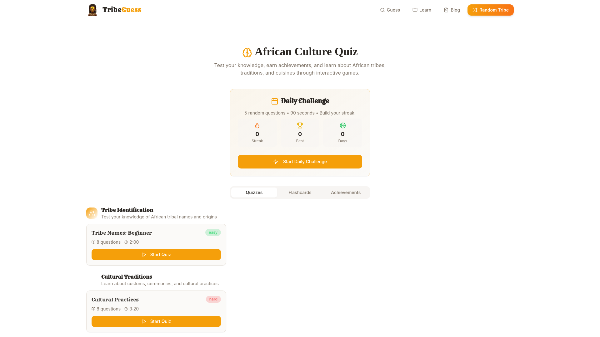
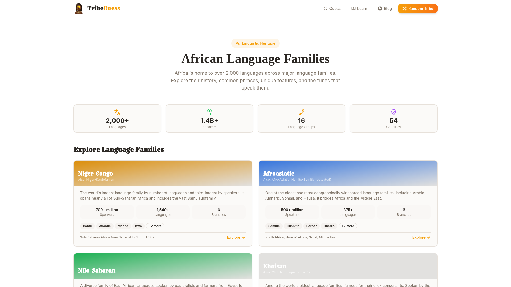

<p align="center">
  
</p>

<h1 align="center">🌍 TribeGuess - African Tribe Guesser</h1>

<p align="center">
  <strong>Discover African heritage through names, culture, and traditions</strong>
</p>

<p align="center">
  <a href="https://tribeguess.com">Live Demo</a> •
  <a href="#-features">Features</a> •
  <a href="#-user-guide">User Guide</a> •
  <a href="#-screenshots">Screenshots</a> •
  <a href="#-roadmap">Roadmap</a>
</p>

---

## 📖 About

**TribeGuess** is an educational entertainment web application that predicts African tribal heritage based on names. It combines a sophisticated name-matching algorithm with a comprehensive cultural encyclopedia covering **250+ tribes** across **25+ African countries**.

The app serves as:
1. **🔮 A Guessing Game** - Enter a name and discover its likely tribal origin
2. **📚 A Cultural Encyclopedia** - Explore detailed information about African tribes, languages, traditions, recipes, and religions
3. **🎓 A Learning Platform** - Quizzes, flashcards, and daily challenges to test your knowledge

### 🎯 Mission

To celebrate and preserve African cultural diversity by making tribal heritage accessible, educational, and engaging for a global audience.

---

## ✨ Features

### Core Features

| Feature | Description |
|---------|-------------|
| **🔮 Name-Based Tribe Detection** | AI-powered algorithm analyzing 9,000+ name patterns, prefixes, and suffixes |
| **📚 Tribe Encyclopedia** | Detailed pages for 250+ tribes with history, culture, meal traditions, and trade relations |
| **🗺️ Interactive Maps** | OpenStreetMap integration showing tribal territories with custom overlays |
| **🍲 Traditional Recipes** | 100+ authentic African dishes with ingredients, instructions, and YouTube tutorials |
| **⛪ Religion Explorer** | 29 documented religions with comparison tools and animated timeline maps |
| **🗣️ Language Families** | 16 language groups with phrases, audio pronunciations, and tribe connections |
| **🎯 Quiz System** | 9+ categories with 75+ questions, flashcards, daily challenges, and achievements |
| **📝 Cultural Blog** | SEO-optimized articles on naming traditions, history, and cuisine |

### Advanced Features

- **Multi-Country Support**: Tracks tribes across borders (e.g., Fulani across 13+ countries)
- **URL State Synchronization**: All filters and searches are shareable via URL
- **Religious Name Detection**: Identifies Muslim/Christian names and suggests relevant tribes
- **Global Origin Detection**: Recognizes non-African name patterns and explains connections
- **Audio Pronunciations**: Web Speech API with African accents for greetings and phrases
- **Meal Traditions**: Eating customs, taboos, and hospitality practices for each tribe
- **Trade & Independence History**: Historical trade relations and anti-colonial resistance

---

## 📸 Screenshots

### Home Page - Guess Her Tribe

*Enter a name and select a country to discover the likely tribal origin with cultural insights.*

### Encyclopedia - Browse All Tribes

*Filter 250+ tribes by country, region, language family, and population with Grid/List/Map views.*

### Tribe Detail Page

*Comprehensive tribe profiles with culture documentaries, greetings, stereotypes, and traditions.*

### Cultural Blog

*Articles on African naming traditions, ethnic diversity, and culinary heritage with region/topic filters.*

### Traditional Recipes

*100+ authentic dishes organized by tribe with ingredients, cooking times, and YouTube tutorials.*

### African Religions

*Explore 29 traditional religions with statistics dashboard, comparison tool, and animated trade route map.*

### African Culture Quiz

*Test your knowledge with quizzes, flashcards, daily challenges, and 13 unique achievements.*

### Language Families

*16 language groups with 2,000+ languages, common phrases, and audio pronunciations.*

---

## 📖 User Guide

### 🔮 Guessing a Tribe

1. **Go to the Home Page** at [tribeguess.com](https://tribeguess.com)
2. **Select a Country** from the dropdown (e.g., 🇰🇪 Kenya, 🇳🇬 Nigeria) or choose "All Africa"
3. **Enter a First Name** - First names work best for analysis
4. **Click "Guess the Tribe"** or press Enter
5. **View Results** - See the predicted tribe(s) with match confidence and cultural insights

**Pro Tips:**
- Use the **"Show Advanced Clues"** button to add time of birth, region, build, and personality for more accurate predictions
- Try popular names shown below the search bar for your selected country
- Share results via URL - the entire prediction is encoded in the link!

### 📚 Browsing the Encyclopedia

1. **Navigate to Learn** at [/learn](https://tribeguess.com/learn)
2. **Search** by tribe name or use filters:
   - 🌍 **Country Filter**: Click flags to filter by specific countries
   - 🗺️ **Region Filter**: Select macro-regions (West Africa, East Africa, etc.)
   - 🗣️ **Language Family**: Filter by Bantu, Nilotic, Cushitic, etc.
   - 📊 **Advanced Filters**: Population range, view mode (Grid/List/Map)
3. **Click a Tribe Card** to view the full detail page
4. **Explore Sections**: Documentary videos, greetings, name meanings, stereotypes, traditions

### 🍲 Exploring Recipes

1. **Navigate to Recipes** at [/recipes](https://tribeguess.com/recipes)
2. **Browse Ingredients**: Click traditional ingredients to learn about staples like Cassava, Plantain, Shea Butter
3. **Filter by Tribe**: Use the tribe filter pills to find dishes from specific ethnic groups
4. **View Recipe Details**: Ingredients, step-by-step instructions, cooking time, and video tutorials
5. **Discover Connections**: Each recipe links back to the tribe and language family pages

### ⛪ Exploring Religions

1. **Navigate to Religions** at [/religions](https://tribeguess.com/religions)
2. **View Statistics Dashboard**: See religion counts, regional distribution, and follower estimates
3. **Compare Religions**: Use the **Compare Tool** to see side-by-side tenets and practices
4. **Explore Timeline Map**: See animated trade routes and historical spread of religions
5. **Click Religion Cards**: View detailed pages with beliefs, rituals, and connected tribes

### 🎯 Taking Quizzes

1. **Navigate to Quiz** at [/quiz](https://tribeguess.com/quiz)
2. **Start Daily Challenge**: Answer 5 random questions in 90 seconds to build your streak
3. **Choose a Category**: 9+ categories including Famous Africans, Colonial History, Music & Dance
4. **Earn Achievements**: Complete challenges for badges like "Speed Demon" and "Perfect Day"
5. **Study with Flashcards**: Review cultural facts in flashcard mode

### 🗣️ Learning Languages

1. **Navigate to Languages** at [/languages](https://tribeguess.com/languages)
2. **Explore Language Families**: Niger-Congo, Afroasiatic, Nilo-Saharan, Khoisan, and more
3. **Listen to Phrases**: Click audio buttons to hear pronunciations with African accents
4. **Connect to Tribes**: Each language family links to the tribes that speak it

---

## 🔗 Quick Links

| Route | Description |
|-------|-------------|
| [`tribeguess.com/`](https://tribeguess.com/) | Home - Guess tribe by name |
| [`tribeguess.com/learn`](https://tribeguess.com/learn) | Encyclopedia - Browse all tribes |
| [`tribeguess.com/learn/:slug`](https://tribeguess.com/learn/kikuyu) | Tribe Detail - Individual tribe page |
| [`tribeguess.com/random`](https://tribeguess.com/random) | Random - Discover a random tribe |
| [`tribeguess.com/blog`](https://tribeguess.com/blog) | Blog - Cultural articles and insights |
| [`tribeguess.com/recipes`](https://tribeguess.com/recipes) | Recipes - Traditional African dishes |
| [`tribeguess.com/religions`](https://tribeguess.com/religions) | Religions - Spiritual traditions directory |
| [`tribeguess.com/quiz`](https://tribeguess.com/quiz) | Quiz - Test your knowledge |
| [`tribeguess.com/languages`](https://tribeguess.com/languages) | Languages - African language families |
| [`tribeguess.com/global-origins`](https://tribeguess.com/global-origins) | Global Origins - Non-African name explorer |
| [`tribeguess.com/religion-timeline`](https://tribeguess.com/religion-timeline) | Religion Timeline - Animated historical map |

**Filter Examples:**
| URL | Description |
|-----|-------------|
| [`/learn?country=NG`](https://tribeguess.com/learn?country=NG) | Nigerian tribes only |
| [`/learn?macroRegion=West%20Africa`](https://tribeguess.com/learn?macroRegion=West%20Africa) | West African tribes |
| [`/learn?languageFamily=Bantu`](https://tribeguess.com/learn?languageFamily=Bantu) | Bantu-speaking tribes |
| [`/?name=Wanjiku&country=KE`](https://tribeguess.com/?name=Wanjiku&country=KE) | Direct guess for Wanjiku (Kenya) |

---

## 📁 Project Structure

```
tribeguess/
├── public/
│   ├── docs/                      # 📸 Documentation screenshots
│   ├── tribes/                    # Tribe-specific images
│   ├── favicon.png                # Site favicon
│   ├── og-image.png               # Social sharing preview
│   ├── sitemap.xml                # SEO sitemap
│   └── robots.txt                 # SEO crawl rules
│
├── src/
│   ├── __tests__/                 # Regression Test System
│   │   ├── REGRESSION_TESTS.md    # Comprehensive test specification
│   │   ├── CHANGE_CHECKLIST.md    # Pre/post change verification
│   │   └── testUtils.ts           # Automated test utilities
│   │
│   ├── assets/
│   │   └── logo.png               # Main application logo
│   │
│   ├── components/
│   │   ├── ui/                    # shadcn/ui component library
│   │   ├── AudioGreeting.tsx      # Audio pronunciation with accents
│   │   ├── BlogAudioPlayer.tsx    # Text-to-speech for articles
│   │   ├── CulturalLandmarks.tsx  # Landmark cards and maps
│   │   ├── DailyChallenge.tsx     # Daily quiz challenge widget
│   │   ├── DynamicMapView.tsx     # Africa-wide interactive map
│   │   ├── GlobalOriginCard.tsx   # Non-African name origin display
│   │   ├── GuessForm.tsx          # Name input with advanced clues
│   │   ├── Header.tsx             # Navigation with Random button
│   │   ├── Footer.tsx             # Global footer navigation
│   │   ├── ImageGallery.tsx       # Tribe culture photo gallery
│   │   ├── PopulationPieChart.tsx # Multi-country population chart
│   │   ├── RelatedBlogs.tsx       # Related articles section
│   │   ├── ReligionStatsDashboard.tsx # Religion statistics
│   │   ├── ShareButton.tsx        # Social sharing popover
│   │   ├── TopTribesCarousel.tsx  # Featured tribes slider
│   │   ├── TribeCard.tsx          # Tribe preview card
│   │   ├── TribeFamilyTree.tsx    # Ethnic lineage visualization
│   │   ├── TribeMap.tsx           # Individual tribe territory map
│   │   └── TribeResultCard.tsx    # Prediction result display
│   │
│   ├── data/
│   │   ├── tribes.json            # Master tribe database (250+ tribes)
│   │   ├── recipes.ts             # Traditional recipes database
│   │   ├── ingredients.ts         # African ingredients database
│   │   ├── traditionalReligions.ts # Religion data and mappings
│   │   ├── tribeLandmarks.ts      # Cultural landmarks with GPS
│   │   ├── languageFamilies.json  # Language families data
│   │   ├── blogPosts.json         # Cultural blog articles
│   │   └── quizzes.json           # Quiz questions and categories
│   │
│   ├── hooks/
│   │   ├── use-mobile.tsx         # Mobile detection hook
│   │   ├── use-toast.ts           # Toast notification hook
│   │   ├── useGlobalSearch.ts     # Combined search hook
│   │   ├── useDailyChallenge.ts   # Daily challenge state
│   │   └── useQuizResults.ts      # Quiz results and achievements
│   │
│   ├── lib/
│   │   ├── tribeDetection.ts      # Core detection algorithm
│   │   ├── globalOrigins.ts       # Non-African name origins
│   │   ├── tribeLinks.ts          # Tribe linking utilities
│   │   └── utils.ts               # Utility functions
│   │
│   └── pages/
│       ├── Index.tsx              # Home - guess form
│       ├── Learn.tsx              # Encyclopedia - grid/map view
│       ├── TribePage.tsx          # Individual tribe detail
│       ├── Blog.tsx               # Cultural articles list
│       ├── BlogPost.tsx           # Individual article page
│       ├── Recipes.tsx            # Recipe directory
│       ├── RecipePage.tsx         # Individual recipe page
│       ├── IngredientPage.tsx     # Ingredient detail page
│       ├── ReligionsPage.tsx      # Religion directory
│       ├── ReligionDetailPage.tsx # Individual religion page
│       ├── ReligionTimeline.tsx   # Animated trade route map
│       ├── ReligionCompare.tsx    # Religion comparison tool
│       ├── Quiz.tsx               # Quiz and flashcards
│       ├── LanguagesIndex.tsx     # Language families directory
│       ├── LanguageFamilyPage.tsx # Individual language family
│       ├── GlobalOrigins.tsx      # Non-African origins explorer
│       ├── RandomTribe.tsx        # Random tribe redirect
│       ├── Privacy.tsx            # Privacy policy
│       ├── Terms.tsx              # Terms of service
│       └── NotFound.tsx           # 404 page
│
├── index.html                     # HTML template with SEO meta
├── tailwind.config.ts             # Tailwind configuration
├── vite.config.ts                 # Vite build configuration
└── vercel.json                    # Vercel deployment config
```

---

## 🛠️ Tech Stack

### Frontend

| Technology | Purpose | Version |
|------------|---------|---------|
| **React** | UI Framework | ^18.3.1 |
| **TypeScript** | Type Safety | ~5.6.2 |
| **Vite** | Build Tool | ^5.4.11 |
| **Tailwind CSS** | Styling | ^3.4.17 |
| **shadcn/ui** | Component Library | Latest |
| **React Router** | Navigation | ^6.30.1 |

### Key Libraries

| Library | Purpose |
|---------|---------|
| `@tanstack/react-query` | Data fetching & caching |
| `lucide-react` | Icon library |
| `react-helmet-async` | SEO meta management |
| `sonner` | Toast notifications |
| `recharts` | Data visualization (charts) |
| `embla-carousel-react` | Carousel component |
| `react-hook-form` + `zod` | Form management & validation |
| `date-fns` | Date utilities |

### External APIs & Services

| Service | Usage |
|---------|-------|
| **OpenStreetMap** | Interactive map tiles |
| **YouTube Embed** | Documentary videos |
| **Web Speech API** | Audio pronunciation |
| **Wikimedia Commons** | Cultural imagery |

---

## 🚀 Getting Started

### Prerequisites

- Node.js 18+ 
- npm or bun

### Installation

```bash
# Clone the repository
git clone https://github.com/yourusername/tribeguess.git

# Navigate to project directory
cd tribeguess

# Install dependencies
npm install

# Start development server
npm run dev
```

### Build for Production

```bash
npm run build
npm run preview
```

---

## 📈 Roadmap

### ✅ Recently Completed

| Feature | Description |
|---------|-------------|
| **🆕 Comprehensive Tribe Data** | 250+ tribes with eatingCustoms, tradeRelations, independenceHistory |
| **🆕 Language Families System** | 16 language groups with phrases, audio, and tribe connections |
| **🆕 Recipe-Language Cross-Linking** | Bidirectional navigation between recipes and language families |
| **🆕 Religion Timeline Map** | Animated trade routes showing historical religious spread |
| **🆕 Quiz & Achievements** | 9 categories, 75+ questions, 13 achievements, daily challenges |
| **🆕 Global Origins Explorer** | Non-African name pattern detection with diaspora connections |
| **🆕 Mobile-Responsive Dropdowns** | Country dropdown shows flag + name on mobile |
| **Ingredients Database** | Dedicated pages for African staples (Plantain, Shea Butter, etc.) |
| **Religion Comparison Tool** | Compare up to 4 religions side-by-side |
| **Audio Pronunciations** | Web Speech API with African accents for all language families |

### 🔴 High Priority (TODO)

| Task | Description | Impact |
|------|-------------|--------|
| **Add More Tribe Images** | Gallery images for tribes currently lacking visuals | Visual appeal |
| **Central African Expansion** | Add DR Congo, Cameroon, CAR tribes with full data | Data completeness |
| **Tribe Migration Maps** | Interactive visualization of historical migrations | Education |
| **Image Lazy Loading** | Lazy load tribe images in grid view | Performance |
| **PWA Support** | Service worker for offline access | Accessibility |

### 🟡 Medium Priority (TODO)

| Task | Description | Impact |
|------|-------------|--------|
| **Tribe Comparison Tool** | Side-by-side culture comparison | Education |
| **Name Submission Form** | Allow users to submit new name meanings | Community |
| **Keyboard Shortcuts** | G/L/M keys for view switching | Power users |
| **Multi-language UI** | Translate to French, Swahili, Portuguese | Reach |
| **More Blog Articles** | Expand coverage of Central/North African topics | Content |

### 🟢 Future Ideas (Backlog)

| Feature | Description |
|---------|-------------|
| **Family Tree Builder** | Map multi-tribal heritage |
| **AR Name Cards** | Augmented reality name meaning cards |
| **Voice Search** | Speak a name to search |
| **Historical Timeline** | Interactive migration timelines |
| **API for Developers** | Public API for tribe data |
| **Mobile App** | React Native or PWA app |
| **User Accounts** | Save favorites, track quiz progress |

### 🐛 Known Issues

| Issue | Status | Workaround |
|-------|--------|------------|
| Some smaller tribes lack gallery images | In progress | Adding images progressively |
| Speech synthesis has limited African language support | Browser limitation | Falls back to closest locale |
| Religion pie charts may not render on first load | Low priority | Refresh the page |

---

## 📋 Data Gaps & Contributions Needed

This section tracks **missing, incomplete, or incorrect data** that needs community contributions.

### 🔴 Missing Tribe Profiles (High Priority)

The following regions have limited or no tribal coverage:

#### Horn of Africa
| Country | Missing Tribes | Notes |
|---------|---------------|-------|
| 🇸🇴 Somalia | Digil, Rahanweyn, Jareer | Only Somali/Isaaq covered |
| 🇩🇯 Djibouti | Afar (detailed profile) | Basic entry exists |
| 🇸🇸 South Sudan | Dinka (detailed), Nuer, Shilluk, Azande | Major gaps |
| 🇸🇩 Sudan | Beja, Nubians (detailed), Fur | Limited coverage |

#### Central Africa ✅ RECENTLY EXPANDED
| Country | Status | Notes |
|---------|--------|-------|
| 🇨🇩 DR Congo | ✅ Added | Luba, Mongo, Kongo, Bakongo with full profiles |
| 🇨🇬 Congo-Brazzaville | ✅ Added | Mbochi profile added |
| 🇹🇩 Chad | Partial | Toubou, Zaghawa added; Sara, Arabs needed |
| 🇨🇫 CAR | ✅ Added | Gbaya, Banda, Mandjia profiles added |
| 🇬🇦 Gabon | ✅ Added | Fang, Punu, Myene, Mitsogo profiles |
| 🇬🇶 Equatorial Guinea | ✅ Added | Bubi, Fang profiles |
| 🇦🇴 Angola | ❌ Missing | Ovimbundu, Kimbundu, Bakongo needed |

#### North Africa ✅ RECENTLY ADDED
| Country | Status | Notes |
|---------|--------|-------|
| 🇪🇬 Egypt | ✅ Added | Egyptian Arab, Nubian profiles with full cultural data |
| 🇱🇾 Libya | ❌ Missing | Berber/Amazigh, Tuareg (LY), Toubou (LY) needed |
| 🇹🇳 Tunisia | ✅ Added | Tunisian Arab profile with history and conflicts |
| 🇩🇿 Algeria | ✅ Added | Amazigh, Kabyle, Chaoui profiles with detailed history |
| 🇲🇦 Morocco | ✅ Added | Moroccan Arab, Amazigh profiles |

### 🟡 Incomplete Tribe Profiles (Medium Priority)

These tribes exist but need more data:

| Tribe | Country | Missing Fields |
|-------|---------|----------------|
| Tuareg | Mali/Niger | `eatingCustoms`, gallery images |
| Bambara | Mali | `tradeHistory`, `independenceHistory` |
| Dogon | Mali | Cultural landmarks, YouTube video |
| Songhai | Niger/Mali | `religiousInfluence`, recipes |
| Moors | Mauritania | `genderRoles`, gallery images |
| Haratin | Mauritania | Historical context, recipes |
| Hausa (Niger) | Niger | Differentiation from Nigerian Hausa |
| Djerma | Niger | `eatingCustoms`, landmarks |
| Himba | Namibia | `tradeHistory`, recipes |
| San | Botswana/Namibia | `independenceHistory`, modernization |
| Berber | Morocco/Algeria | Full profile needed |

### 🟡 Missing Cultural Landmarks

Tribes lacking verified GPS landmarks in `tribeLandmarks.ts`:

| Region | Tribes Needing Landmarks |
|--------|-------------------------|
| Sahel | Tuareg, Bambara, Dogon, Songhai, Moors, Djerma |
| Central Africa | Fang, Myene, Punu, Bubi, Hutu, Tutsi |
| Southern Africa | Himba, San, Tswana, Ndebele, Venda |
| Horn of Africa | Somali (more), Afar, Dinka, Nuer |

### 🟡 Missing Recipes

Tribes/regions needing traditional recipes in `recipes.ts`:

| Category | Needed |
|----------|--------|
| Sahel Cuisine | Thiakry (Senegal), Dégué (Mali), Millet couscous |
| Central African | Saka-saka (Congo), Moambe chicken, Chikwanga |
| North African | Berber tagine, Couscous (Algerian), Harira |
| Horn of Africa | Kitcha (Eritrea), Injera variations, Somali rice |
| Beverages | Palm wine (detailed), Hibiscus drinks, Baobab juice |

### 🟡 Missing Language Families

Expand `languageFamilies.json` with:

| Family | Subgroups Needed |
|--------|------------------|
| Afroasiatic | Coptic (historical), Berber subgroups |
| Nilo-Saharan | Fur-Amdang, Saharan, Songhay (expanded) |
| Khoisan | Detailed breakdown of click languages |
| Austronesian | Malagasy (Madagascar connection) |

### 🔴 Incorrect/Outdated Data (Needs Verification)

| Data Point | Issue | Source Needed |
|------------|-------|---------------|
| Some population estimates | May be outdated (pre-2020) | Joshua Project 2024 |
| Trans-border tribe distributions | Border changes not reflected | Ethnologue 2024 |
| Religion percentages | Colonial-era estimates | Pew Research |
| Some name meanings | Unverified folk etymologies | Academic sources |
| Trade route dates | Approximations | Historical archives |

### 📝 How to Contribute Data

1. **Use Issue Templates**: Visit [GitHub Issues](https://github.com/yourusername/tribeguess/issues/new/choose) and select the appropriate template:
   - `data_new_tribe.yml` - Add a new tribe
   - `data_new_recipe.yml` - Add a traditional recipe
   - `data_spelling_correction.yml` - Fix spelling/translation errors
   - `data_name_meaning.yml` - Add/correct name meanings
   - `data_new_language.yml` - Add language family data
   - `data_famous_person.yml` - Add notable person to quiz

2. **Required for All Contributions**:
   - Source citation (academic paper, official website, or museum)
   - Country and region context
   - Verification that data doesn't already exist

3. **Image Contributions**:
   - Must be Wikimedia Commons, Creative Commons, or original
   - Include attribution and license information
   - Minimum resolution: 800x600

---

## 📊 Data Sources & Verification

All tribe data is triple fact-checked against verified sources:

### Academic Sources
- Ethnologue (ethnologue.com) - Language data
- Joshua Project (joshuaproject.net) - Population estimates
- Wikipedia (with cross-referencing) - Historical context

### Cultural Archives
- Gikuyu Cultural Foundation
- Buganda Kingdom Archives
- Luo Cultural Heritage
- YorubaName.com
- Ulwazi Programme (South Africa)

### Media Sources
- YouTube documentaries (manually verified)
- Wikimedia Commons (cultural photography)

---

## 🤝 Contributing

Contributions are welcome! Please read our contributing guidelines before submitting PRs.

### Areas Needing Help

1. **Data Entry**: Adding tribes from Central/North Africa
2. **Translations**: UI in African languages (French, Swahili, Arabic)
3. **Verification**: Cross-checking name meanings and population data
4. **Photography**: Cultural images with proper licensing
5. **Content**: Blog articles on underrepresented regions

---

## 📄 License

This project is for educational and entertainment purposes. Tribe data is compiled from public sources.

---

## ⚠️ Disclaimer

This application is for **entertainment and educational purposes only**. 

- Predictions are based on common naming patterns and may not be accurate for all names
- Stereotypes presented are common perceptions and may not apply to individuals
- We respect all cultures and aim to celebrate African diversity
- Always verify important cultural information with authoritative sources

---

<p align="center">
  <strong>Made with ❤️ for African Cultural Heritage</strong>
</p>

<p align="center">
  <a href="https://tribeguess.com">tribeguess.com</a>
</p>
